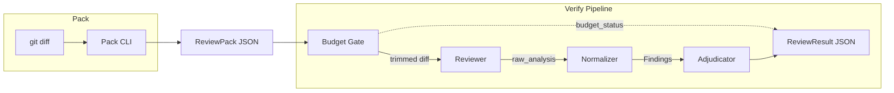

# CrossReview

English | [简体中文](README.zh-CN.md)

> Automated cross-review for AI coding assistants — a fresh, isolated LLM session verifies what your assistant produced.

## What is Cross-Review?

When a human team reviews code, the author doesn't review their own pull request — a **different person** looks at it with fresh eyes. CrossReview brings the same discipline to AI-generated code.

Your AI coding assistant (Claude, Copilot, Cursor, etc.) writes code in one session. CrossReview sends the resulting diff to a **separate LLM session** that has never seen the original conversation. This "cross-reviewer" evaluates the change with no shared context — no confirmation bias, no inherited blind spots.

The key insight: **you don't need a different model, just a different context.** Same model, clean session, real findings.

## Why It Works

The author session carries every assumption, workaround, and shortcut it made — confirmation bias baked into the context window. The cross-reviewer sees only what matters:

| Cross-reviewer sees | Cross-reviewer doesn't see |
|---------------------|---------------------------|
| The diff | Original conversation |
| Stated intent | Planning & reasoning chain |
| Focus areas | Tool call history |
| Context files | Errors & retries |

This targeted information asymmetry is what makes cross-review effective: enough context to understand the change, not enough to inherit the author's blind spots.

## Early Results

Preliminary evaluation across 4 real-world fixtures (tool-assisted isolated reviewer, claude-opus-4.6):

- **Precision 1.00** — zero false positives (improved from 0.45 in Round 1 after introducing Findings/Observations split)
- **Recall 0.75** — one baseline finding missed (bash multiline continuation semantics)
- **Invalid findings per run: 0.00**

These results validate the direction but are too small to be conclusive. A full eval harness with 13+ fixtures and [8 release gate metrics](docs/v0-scope.md) is in progress.

## Quick Start

```bash
pip install -e .                    # full CLI (pack + verify, without standalone reviewer dependency)
pip install -e '.[anthropic]'       # + Anthropic standalone reviewer backend

crossreview pack --diff HEAD~1 --intent "fix auth token refresh" > pack.json
crossreview verify --pack pack.json
```

`crossreview verify` outputs `ReviewResult` JSON to stdout:

```jsonc
{
  "verdict": "has_findings",
  "findings": [
    {
      "id": "f-001",
      "file": "src/auth.py",
      "severity": "high",
      "category": "logic_error",
      "description": "Token refresh silently succeeds when refresh_token is expired",
      "why": "The try/except on line 42 catches TokenExpiredError but returns the old token instead of raising",
      "actionable": true
    }
  ],
  "quality_metrics": {
    "budget_status": "complete",
    "pack_completeness": 0.85,
    "speculative_ratio": 0.0
  }
}
```

## Architecture



| Component | Role |
|-----------|------|
| **Budget Gate** | Focus files first, diff order preserved, soft/hard char cap truncation |
| **Reviewer** | Context-isolated LLM session, outputs free-form analysis (`raw_analysis`) |
| **Normalizer** | Deterministic regex/heuristic, extracts structured `Finding` objects |
| **Adjudicator** | Deterministic rule engine, produces advisory verdict |

## Installation

```bash
pip install -e .                    # full CLI (pack + verify, without standalone reviewer dependency)
pip install -e '.[anthropic]'       # + Anthropic standalone reviewer backend
pip install -e '.[dev]'             # dev dependencies (pytest + ruff)
```

Two reviewer backend modes:

| Mode | Description | Dependency |
|------|-------------|------------|
| **Host-integrated** *(planned)* | AI coding assistant provides fresh-session backend | No extra SDK |
| **Standalone** *(implemented)* | CLI calls LLM API directly | `crossreview[anthropic]` + API key |

Host-integrated is the planned default product path; standalone is the current portable implementation.

## Commands

### `crossreview pack`

```bash
crossreview pack --diff HEAD~1 > pack.json
crossreview pack --diff main..feat --intent "add caching" --focus cache --context ./plan.md > pack.json
```

| Flag | Description |
|------|-------------|
| `--diff REF` | Git ref (`HEAD~1`) or range (`main..feat`) |
| `--intent TEXT` | Task intent (background claim, not ground truth) |
| `--task FILE` | Full task description file |
| `--focus TERM` | Focus review area (repeatable) |
| `--context FILE` | Extra context file (repeatable) |

### `crossreview verify`

```bash
crossreview verify --pack pack.json
crossreview verify --pack pack.json --model claude-sonnet-4-20250514 --provider anthropic
```

| Flag | Description |
|------|-------------|
| `--pack FILE` | Path to ReviewPack JSON |
| `--model TEXT` | Override reviewer model |
| `--provider TEXT` | Override provider (currently `anthropic` only) |
| `--api-key-env VAR` | Override API key env variable name |

## Status

| Component | Status | Notes |
|-----------|--------|-------|
| Schema (1A) | ✅ Done | ReviewPack / Finding / ReviewResult / Config |
| Pack CLI (1B.1 + 1C.1) | ✅ Done | `crossreview pack` |
| Budget Gate (1B.3) | ✅ Done | Focus priority + soft/hard truncation |
| Reviewer (1B.4) | ✅ Done | ReviewerBackend protocol + Anthropic standalone |
| Normalizer (1B.5) | ✅ Done | Deterministic regex/heuristic |
| Adjudicator (1B.6) | ✅ Done | Minimal advisory verdict rules |
| Verify CLI (1C.2) | ✅ Done | `crossreview verify --pack` |
| Evidence Collector (1B.2) | 🔜 Next | ReviewPack.evidence path exists, empty evidence works |
| Eval Harness (1D.1) | 🔜 Next | Depends on stable ReviewResult semantics |
| Output Formatter (1B.7) | 🔜 Next | `--format human` |
| Full Verify CLI (1C.2+) | 🔜 Next | `--diff` one-stop path |

## v0 Scope

**Supported**: `code_diff` artifact only · advisory verdict · single `fresh_llm_reviewer` · deterministic adjudicator and normalizer (no LLM fallback)

**Out of scope (v0)**: Python SDK · MCP Server · Agent Skill · CI/CD Action · cross-model reviewer · verdict = block

**Release gate**: v0 must pass [8 blocking metrics](docs/v0-scope.md) (§12), including manual_recall ≥ 0.80, precision ≥ 0.70, fixture_count ≥ 20, invalid_per_run ≤ 0.20, and 4 others. Fail → revert to prompt pattern, no standalone product.

## License

MIT
