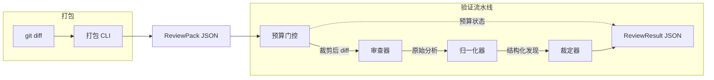

# CrossReview

[English](README.md) | 简体中文

> AI 编码助手的自动化交叉审查 —— 用全新的隔离 LLM session 验证助手的产出。

## 什么是交叉审查？

人类团队做 code review 时，作者不会审查自己的 PR —— **另一个人**用全新的视角来看。CrossReview 把同样的纪律带到 AI 生成代码上。

你的 AI 编码助手（Claude、Copilot、Cursor 等）在一个 session 中写代码。CrossReview 把产出的 diff 发送到一个**独立的 LLM session**，这个 session 从未见过原始对话。这个"交叉审查者"在零共享上下文的条件下评估变更 —— 没有确认偏差，没有继承的盲区。

核心洞察：**你不需要换一个模型，只需要换一个上下文。** 同模型，干净 session，真实发现。

## 为什么有效

作者 session 携带了它做出的每一个假设、变通和捷径 —— 确认偏差直接嵌入了上下文窗口。交叉审查者只看到关键信息：

| 交叉审查者能看到 | 交叉审查者看不到 |
|-----------------|----------------|
| diff 变更内容 | 原始对话 |
| 声明的意图 | 规划和推理链 |
| 重点区域 | 工具调用历史 |
| 上下文文件 | 错误和重试记录 |

这种有针对性的信息不对称正是交叉审查有效的原因：足够的上下文来理解变更，但不至于继承作者的盲区。

## 早期评测结果

4 个真实 fixture 的初步评测（tool-assisted isolated reviewer，claude-opus-4.6）：

- **精确率 1.00** —— 零误报（从 Round 1 的 0.45 提升，得益于 Findings/Observations 输出分桶）
- **召回率 0.75** —— 遗漏 1 条 baseline finding（bash 多行续行语义）
- **每次运行无效发现数：0.00**

这些结果验证了方向正确，但样本太小不能作为定论。包含 13+ fixtures 和 [8 项 release gate 指标](docs/v0-scope.md)的完整评测框架正在开发中。

## 快速开始

```bash
pip install -e .                    # 完整 CLI（pack + verify，不含 standalone reviewer 依赖）
pip install -e '.[anthropic]'       # 加 Anthropic standalone reviewer 后端

crossreview pack --diff HEAD~1 --intent "fix auth token refresh" > pack.json
crossreview verify --pack pack.json
```

`crossreview verify` 输出 `ReviewResult` JSON 到 stdout：

```jsonc
{
  "verdict": "has_findings",
  "findings": [
    {
      "id": "f-001",
      "file": "src/auth.py",
      "severity": "high",
      "category": "logic_error",
      "description": "Token refresh 在 refresh_token 过期时静默成功",
      "why": "第 42 行的 try/except 捕获了 TokenExpiredError 但返回旧 token 而非抛出异常",
      "actionable": true
    }
  ],
  "quality_metrics": {
    "budget_status": "complete",
    "pack_completeness": 0.85,
    "speculative_ratio": 0.0
  }
}
```

## 架构



| 组件 | 职责 |
|------|------|
| **预算门控** (Budget Gate) | focus 文件优先 + diff 原顺序，按 max_files / max_chars_total 截断 |
| **审查器** (Reviewer) | 上下文隔离的 LLM session，输出自由分析文本（raw_analysis） |
| **归一化器** (Normalizer) | 确定性 regex/heuristic，从 raw_analysis 提取结构化 Finding |
| **裁定器** (Adjudicator) | 确定性规则引擎，产出 advisory verdict |

## 安装

```bash
pip install -e .                    # 完整 CLI（pack + verify，不含 standalone reviewer 依赖）
pip install -e '.[anthropic]'       # 加 Anthropic standalone reviewer 后端
pip install -e '.[dev]'             # 开发依赖（pytest + ruff）
```

Reviewer 后端有两种模式：

| 模式 | 说明 | 依赖 |
|------|------|------|
| **Host-integrated** *（计划中）* | 宿主（AI 编码助手）提供 fresh-session 后端 | 无额外 SDK |
| **Standalone** *（已实现）* | CLI 直接调 LLM API | `crossreview[anthropic]` + API key |

Host-integrated 是计划中的默认产品路径；standalone 是当前已实现的 portable 方案。

## 命令

### `crossreview pack`

```bash
crossreview pack --diff HEAD~1 > pack.json
crossreview pack --diff main..feat --intent "add caching" --focus cache --context ./plan.md > pack.json
```

| 参数 | 说明 |
|------|------|
| `--diff REF` | Git ref（`HEAD~1`）或范围（`main..feat`） |
| `--intent TEXT` | 任务意图（背景声明，非真相） |
| `--task FILE` | 完整任务描述文件 |
| `--focus TERM` | 重点审查区域（可重复） |
| `--context FILE` | 额外 context 文件（可重复） |

### `crossreview verify`

```bash
crossreview verify --pack pack.json
crossreview verify --pack pack.json --model claude-sonnet-4-20250514 --provider anthropic
```

| 参数 | 说明 |
|------|------|
| `--pack FILE` | ReviewPack JSON 文件路径 |
| `--model TEXT` | 覆盖 reviewer 模型 |
| `--provider TEXT` | 覆盖 provider（当前仅 `anthropic`） |
| `--api-key-env VAR` | 覆盖 API key 环境变量名 |

## 当前状态

| 组件 | 状态 | 说明 |
|------|------|------|
| Schema (1A) | ✅ 完成 | ReviewPack / Finding / ReviewResult / Config |
| Pack CLI (1B.1 + 1C.1) | ✅ 完成 | `crossreview pack` |
| Budget Gate (1B.3) | ✅ 完成 | focus 优先 + soft/hard 截断 |
| Reviewer (1B.4) | ✅ 完成 | ReviewerBackend 接口 + Anthropic standalone |
| Normalizer (1B.5) | ✅ 完成 | 确定性 regex/heuristic |
| Adjudicator (1B.6) | ✅ 完成 | 最小 advisory verdict 规则 |
| Verify CLI (1C.2) | ✅ 完成 | `crossreview verify --pack` |
| Evidence Collector (1B.2) | 🔜 待做 | ReviewPack.evidence 通路已有，空 evidence 可正常运行 |
| Eval Harness (1D.1) | 🔜 待做 | 依赖已稳定的 ReviewResult 语义 |
| Output Formatter (1B.7) | 🔜 待做 | `--format human` |
| Full Verify CLI (1C.2+) | 🔜 待做 | `--diff` 一站式路径 |

## v0 边界

**当前支持**: 仅 `code_diff` artifact · advisory verdict · 单 reviewer（`fresh_llm_reviewer`） · 确定性 adjudicator 和 normalizer（不做 LLM fallback）

**明确不做（v0）**: Python SDK · MCP Server · Agent Skill · CI/CD Action · cross-model reviewer · verdict = block

**Release gate**: v0 需通过 [8 项 blocking 指标](docs/v0-scope.md)（§12），包括 manual_recall ≥ 0.80、precision ≥ 0.70、fixture_count ≥ 20、invalid_per_run ≤ 0.20 等。不满足 → 退回为 prompt pattern，不做独立产品化。

## 许可

MIT
